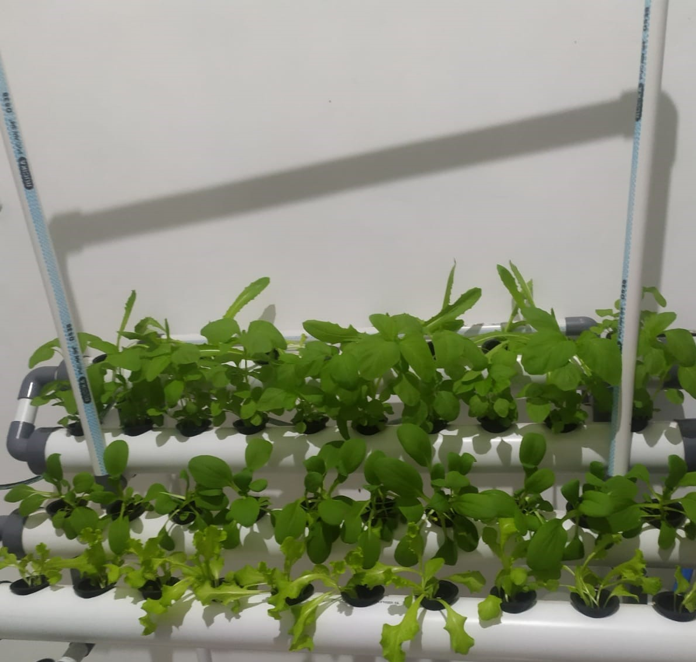
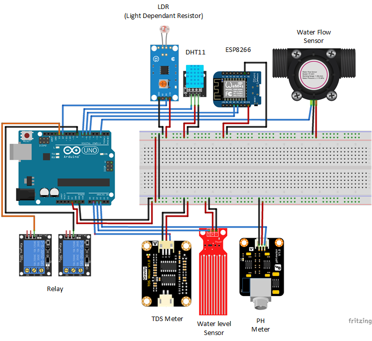
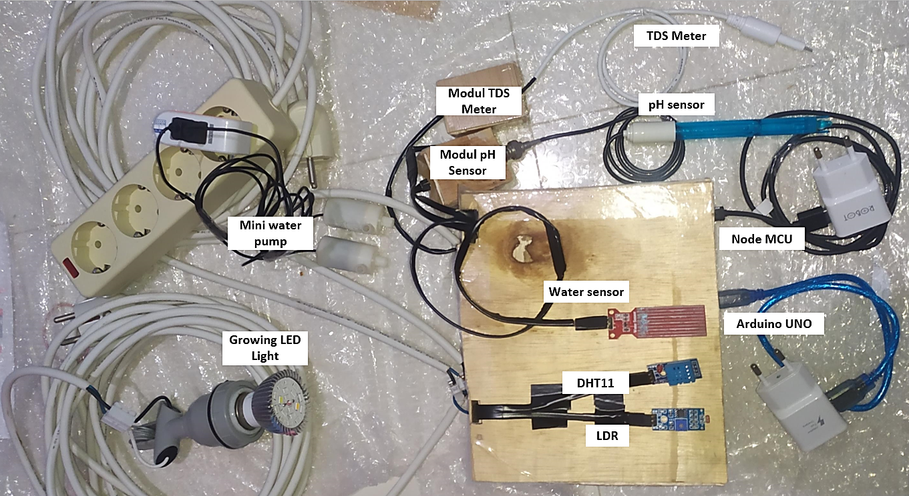
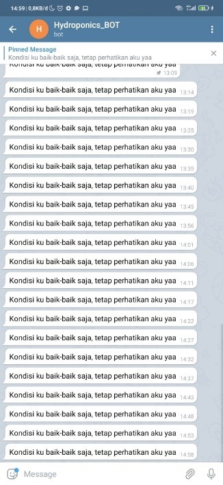

# Sistem Kontrol Kesuburan Tanaman Hidroponik Otomatis menggunakan Artificial Neural Network

#### Reza Octaviany | 14117062
#### Pembimbing: Martin C.T. Manullang, S.T., M.T.

#
#
#### Abstrak
> Pandemi Covid-19 menyebabkan banyak masyarakat tidak dapat keluar rumah, sehingga mencari aktivitas lain agar hari tidak membosankan, salah satu kegiatan alternatif adalah berkebun hidroponik, karena kebun hidroponik tidak membutuhkan lahan yang luas. Namun, masyarakat menemukan beberapa masalah pada tanaman hidroponik, seperti tanaman yang tidak tumbuh, layu, dan mati, karena kurangnya memperhatikan tanaman hidroponik. Salah satu solusinya adalah Sistem Kontrol Kesuburan Tanaman Hidroponik Otomatis Menggunakan Artificial Neural Network (ANN), yang dapat membantu pengguna sistem untuk memantau kesuburan tanaman hidroponik selada, pakcoy dan bayam.
Sistem dibuat menggunakan dua Algoritma ANN yang berbeda, Arduino UNO, Azure Cloud sebagai VPS (Virtual Private Server), Python 3 untuk melakukan learning ANN, dan notifikasi pada Telegram. Pengujian pada sistem dibagi menjadi, pengujian algoritma ANN dengan melakukan studi kasus, pengujian fungsional alat terhadap tanaman dengan mengukur kuantitas dan kualitas tanaman pada masa tanam dan panen, serta pengujian pengaruh efektifitas alat yang dirasakan pengguna menggunakan System Usability Scale (SUS). 
Diperoleh hasil bahwa algoritma yang diterapkan dapat meningkatkan produktifitas tanaman sebesar 5.67% pada daun, dan 18.43% pada batang, untuk algoritma pertama, serta 13.91% pada daun, dan 15.28% pada batang, untuk algoritma keedua. Sistem juga mendapat nilai baik pada pengambilan skor SUS. 

> Keyword: Hidroponik, Kontrol Kesuburan, Artificial Neural Network, Virtual Private Server, Arduino UNO.

#### Abstract
> Covid-19 pandemic caused people unable to leave the house, people start to seek alternate activities therefore days would not be boring, one of alternate activities is hydroponic gardening, by reason it does not need spacious place. However, people find some matters while grow hydroponic plants, such as not growing plants, withered plants, even dead plants, by reason of pay less attention to the hydroponic plants. One of the solutions is Automatic Hydroponic Plant Fertility Control System using Artificial Neural Network (ANN), this system allows users to monitor the fertility of hydroponic lettuce, pakcoy and spinach.
The system uses two different ANN Algorithms, Arduino UNO, Azure Cloud VPS (Virtual Private Server), Python 3 for ANN learning, and Telegram notifications. System testing are divided into testing the ANN algorithm by doing case studies, functional testing on plants by measuring the quantity and quality of plants while planting and harvesting, and testing the effect of the effectiveness for user using System Usability Scale (SUS).
Results showed the algorithm increase plant productivity by 5.67% on leaves, and 18.43% on stems for the first algorithm, 13.91% on leaves, and 15.28% on stems for the second algorithm. The system also scores good on SUS standard.

> Keyword: Hydroponic, fertility monitor, Artificial Neural Network, Virtual Private Server, Arduino UNO.

### Features
- Menerima notifikasi kondisi lingkungan tumbuhan melalui telegram
- Otomatis menghidupkan Aktuator dengan ANN (lampu dan pompa air)

### Things to setup
| Kebutuhan | Versi | 
| ------ |  ------ |
| Virtual Private Server | Disesuaikan (dapat diganti dengan RasPI/Pc)|
| Postman (opsional) | 3.8.9 |
| Google Chrome (atau browser lain) | 7.36.6 |
| Python | 3.8.9 |
| Anaconda Jupyter Notebook | 6.0.1 |
| Tensorflow | 2.1.0 |
| MySql | 8.0 |

### Embedded Hardware

### Telegram Notification

### Contact 
| My Contact | Link |
| ------ |  ------ |
| Email | [93rezao@gmail.com](mailto:93rezao@gmail.com) |
| Github | [recchan13](https://github.com/recchan13) |
